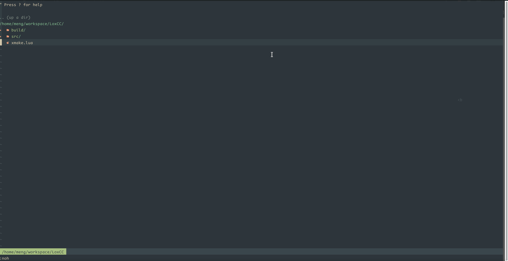

# VIM C++环境

### Require
* clangd
* fuzzy
* vim9

### 安装配置
```bash
# 只支持vim9
git clone https://github.com/plutolove/vim.git
cd vim
bash install.sh

```
### 自定义配置
* clangd的参数可以自己改对应的配置
```vimscript
var lspServers = [
    {
        filetype: ['c', 'cpp'],
        path: '/usr/bin/clangd',
        args: ['--log=verbose', '--pretty', '--all-scopes-completion', '--completion-style=detailed', '--header-insertion=iwyu', '-j=8', '--background-index', '--compile-commands-dir=build']
    }
]
```
### 快捷键
* Leader -> \
* Leader+t -> terminal
* Leader+ff -> 搜索文件
* Leader+fr -> grep 所有文件
* Leader+fb -> grep当前文件
* gd -> go define
* pd -> peek define
* Leader+ca -> code action
